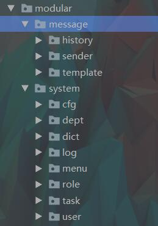

# 基本包结构

本节详细说明本项目的基本目录结构

## material-admin模块

material-admin包含3个核心模块：
- material-core
- material-generator
- material-manage 

其中material-manage一个java web模块，其他都为java se项目；
具体每个包的作用通过名字即可看出包含的功能分别为：核心模块，代码生成模块，web管理模块
 

具体每个包里的细节不详细介绍，开发人员可以在使用过程中逐渐了解，本身代码量并不大，熟悉起来不需要花费太多时间。

这里仅详细说明下material-manage的内部结构，毕竟日常开发主要是基于该模块来做的。

## material-manage
material-manage是一个标准的java web项目

目录结构包含：

- src/main/java  java源码
- src/main/resources  配置文件
- src/webapp  web页面和静态文件资源
这里介绍下material-manage的基本目录和开发流程

### src/main/java/ 源代码

目录结构如下所示：

- **common** 该package 封装了一些工具的类库，如一些注解，常量、枚举，异常等公共类
- **config** 该package 包含项目支持各种特性的相关配置。例如：
    - 支持swagger在线文档的配置
    - EhCache缓存配置
    - Session配置
    - Shiro配置
    - Beetl模版配置
- **core** 该package是项目的核心，包含注入数据源管理、缓存管理、模版管理、aop，监听器以及分页工具、各种工具类。
当然开发人员可以根据项目实际情况做二次调整和封装。

- **modular** 该pakcage存放和业务相关的代码。
比如目前提供了一个**system模块**，主要包含诸如：用户、角色、权限、日志等管理功能的系统管理功能。
system包中除了controller包是必须的，其他包都是根据具体情况选择是否需要。 
 

### src/webapp  web页面和静态文件资源
 
目录结构如下所示：

- static 目录为静态资源
    - css、fonts，img，js分别为公共的样式、字体，图片，js资源
    - modular 目录为业务用js资源，比如system即为admin内置功能的js资源，其中每个功能使用一个目录和WEB-INF/view/中的目录一一对应
    
    
    
- WEB-INF/view 为页面目录
    - common 为公共的页面框架和封装的标签目录
    - 其他目录为业务页面目录，比如system即为内置的功能页面包括用户、角色、权限等管理功能的页面
    
    

