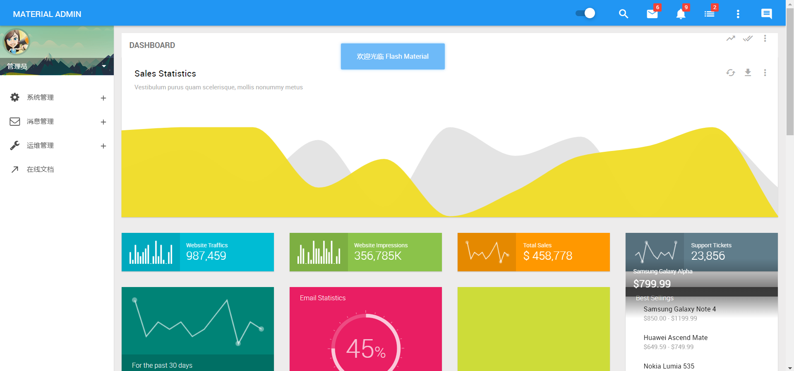

# 启动项目

- 右键直接运行 cn.enilu.material.admin.AdminApplication类即可启动material-manage后台管理系统
- 系统默认是用8085端口，参考配置文件src/resources/application.properties
```properties
server.port=8085
```
- 启动成功后访问http://localhost:8085 如下图所示

- 输入用户名/密码：admin/admin即可登录：



so，是不是很简单!